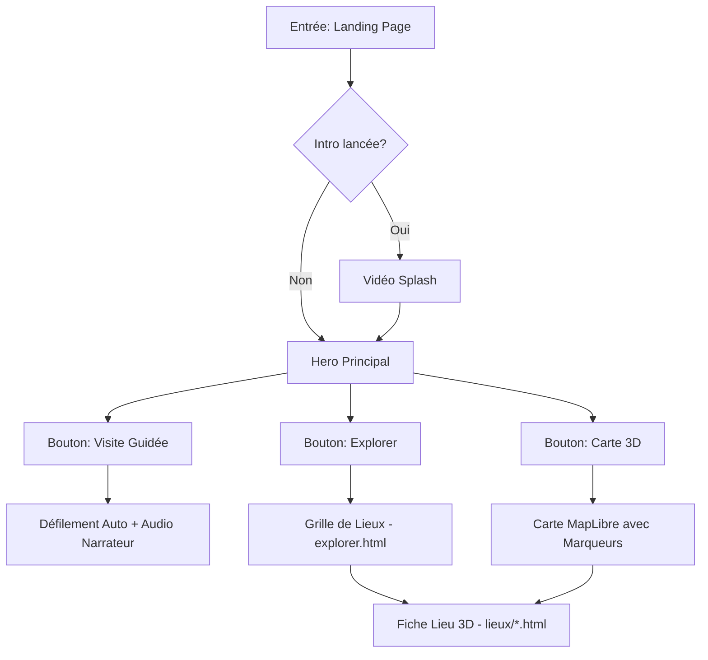

# Description de la Plateforme

## Présentation
TRACA est une Single Page Application (SPA) multi-vues qui combine des éléments de navigation web classique avec des modules d'immersion interactive. Elle se distingue par une interface "transparente" (UI invisible) qui favorise le contenu visuel.

## Expérience Utilisateur (UX)
L'utilisateur est accueilli par une vidéo d'introduction émotionnelle (Logo + Son). Suite à cela, il a deux choix majeurs :
1. **La Voie Guidée** : Appuyer sur "Démarrer la visite" pour se laisser porter.
2. **La Voie Exploratrice** : Utiliser la barre de navigation pour naviguer manuellement vers la Carte ou le Catalogue.

---

# Parcours Utilisateur (User Flows)

---

# Fonctionnalités Clés

### 1. Moteur de Visite Guidée
- **Technologie** : GSAP ScrollTo + Audio API.
- **Fonctionnement** : Synchronise le défilement de la page sur la durée de fichiers audio mp3.
- **Avantage** : Onboarding immédiat sans effort pour l'utilisateur.

### 2. Explorateur de Lieux
- **Technologie** : CSS Grid / Sketchfab API.
- **Fonctionnement** : Catalogue des typologies patrimoniales avec fiches dédiées intégrant une scène 3D interactive.

### 3. Carte Immersive
- **Technologie** : MapLibre GL.
- **Fonctionnement** : Vue aérienne 3D de l'Algérie avec filtres par époque et wilaya.

---

# Roadmap Produit

### V1 (Actuelle)
- [x] Accueil avec Visite Guidée.
- [x] Catalogue 3D (5 sites de démonstration).
- [x] Carte interactive de base.

### V2 (Prochainement)
- [ ] Moteur de recherche global.
- [ ] Système multi-langues (Français, Arabe, Anglais) fonctionnel à 100%.
- [ ] Chroniques dynamiques via un CMS léger.

### V3 (Futur)
- [ ] VR Mode (WebXR).
- [ ] Compte utilisateur pour "sauvegarder" ses favoris.
